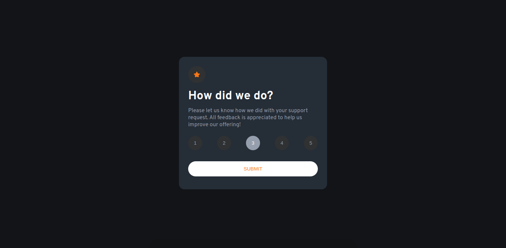

# Frontend Mentor - Interactive rating component solution

This is a solution to the [Interactive rating component challenge on Frontend Mentor](https://www.frontendmentor.io/challenges/interactive-rating-component-koxpeBUmI) 

## Table of contents

- [Overview](#overview)
  - [Screenshot](#screenshot)
  - [Links](#links)
- [My process](#my-process)
  - [Built with](#built-with)
  - [Continued development](#continued-development)
  - [Useful resources](#useful-resources)
- [Author](#author)
- [Acknowledgments](#acknowledgments)

## Overview

### Screenshot

*

### Links

- Solution URL: [https://github.com/Raymacmillan/Interactive-Rating-Component](https://your-solution-url.com)
- Live Site URL: [https://raymacmillan.github.io/Interactive-Rating-Component/](https://your-live-site-url.com)

## My process

### Built with

- Semantic HTML5 markup
- Flexbox
- Mobile-first workflow
- [Styled Components](https://styled-components.com/) - For styles

### Continued development

I learnt how to convert Nodelist into Array list with the help of StackOverflow.I also learnt how to use delegation method to target Javascript elements that are displayed after Javascript is run even though i did not implement it on my project as i found a much easier way to do that ...Lastly i learnt how to use forEach() function which was really cool!!
### Useful resources

- [Example resource 1](https://stackoverflow.com/questions/3199588/fastest-way-to-convert-javascript-nodelist-to-array) - This helped me to learn how to convert a NodeList into an array which was really helpful as i did not know any other way of working with Nodelists

## Author

- Frontend Mentor - [@Ray Mcmillan Gumbo](https://www.frontendmentor.io/profile/Raymacmillan)
- Twitter - [@RyoGenex](https://twitter.com/RyoGenex)

## Acknowledgments

I would like to thank StackOverflow for the assistance and insight i recieved as well as Google fonts for all the fonts i used on my website
